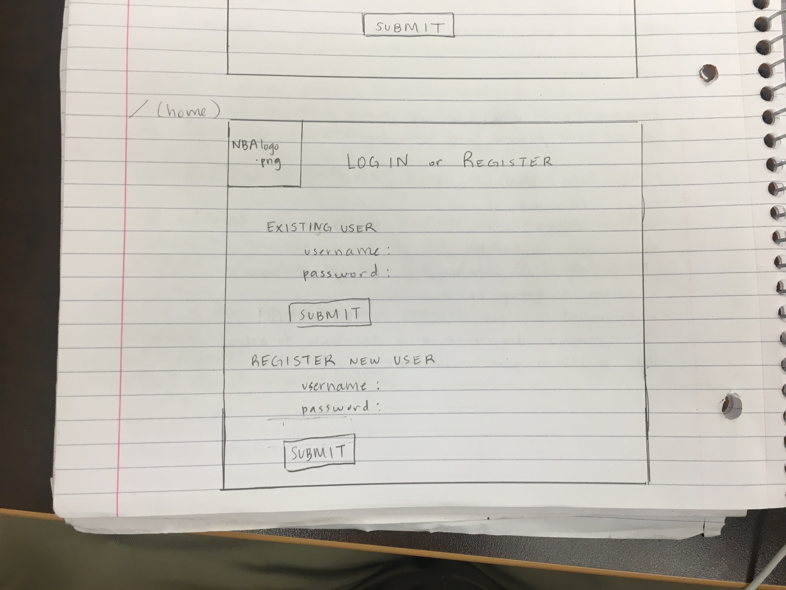
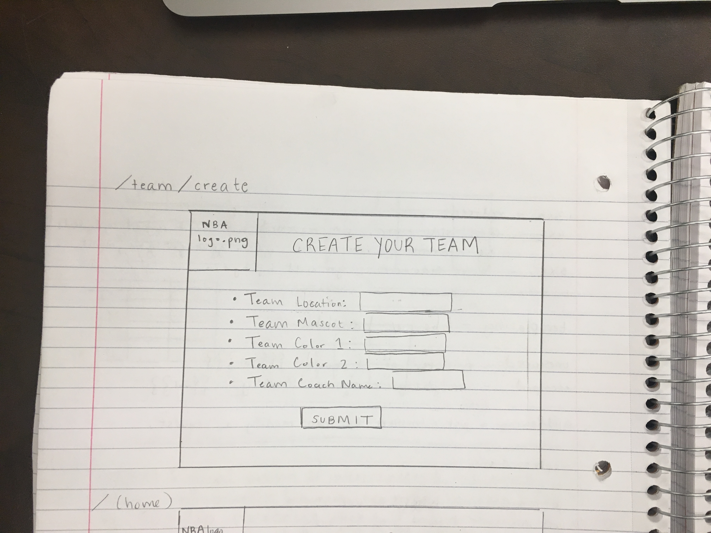
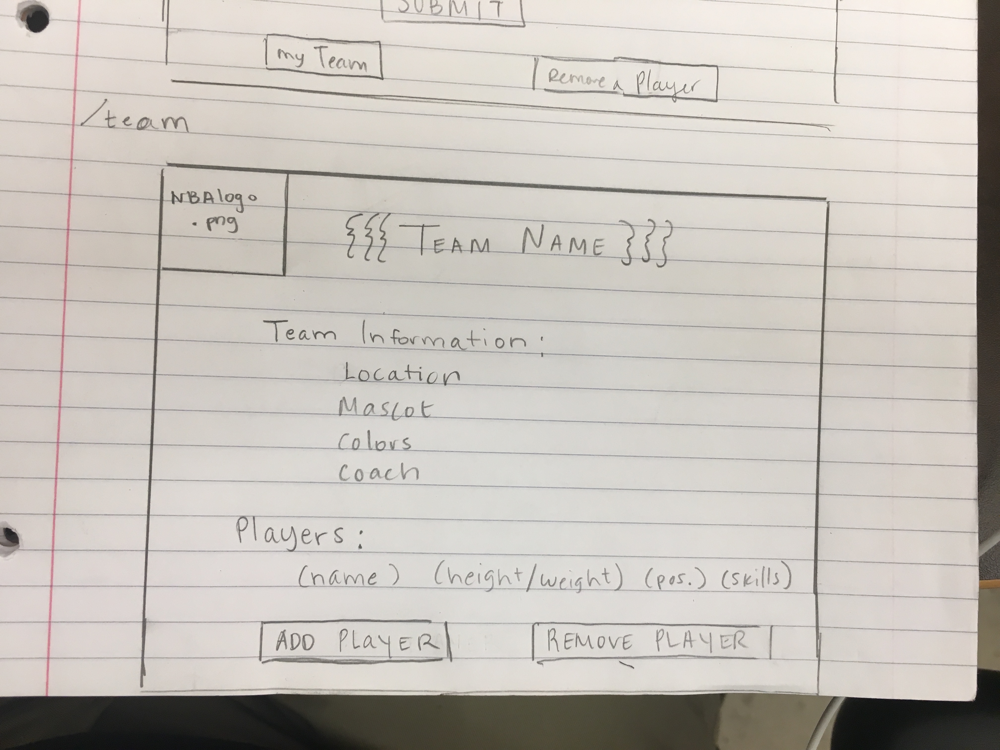
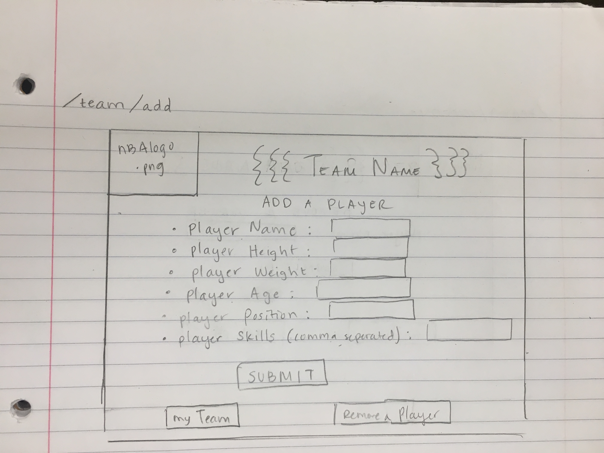
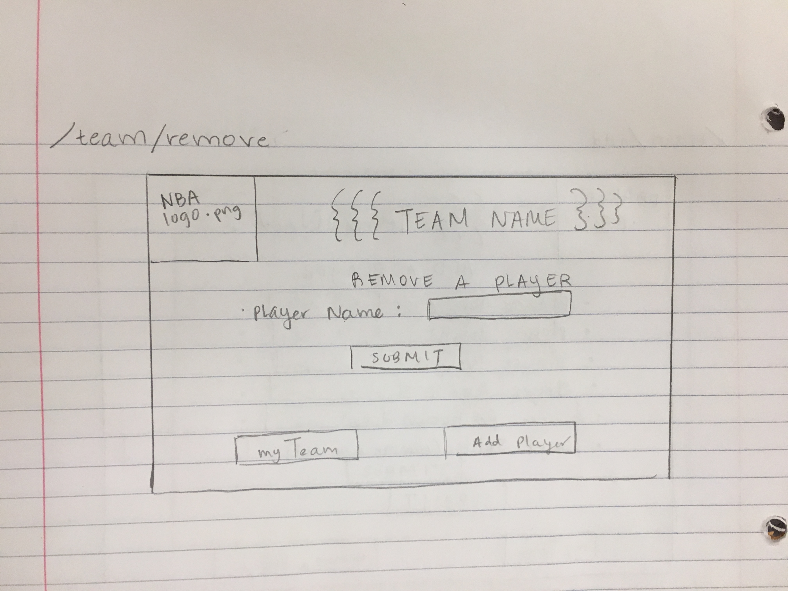

The content below is an example project proposal / requirements document. Replace the text below the lines marked "__TODO__" with details specific to your project. Remove the "TODO" lines.

(___TODO__: your project name_)

# NBA myGM Lite

## Overview


Have you ever wanted to manage and run your own NBA team? Well now you can, using NBA myGM!

NBA myGM is a web app that will allow users to keep track of players on their team. Users can register and login. Once they're logged in, they can create or view their NBA Team. Users can add Players to their team and fill in each player's information (height, weight, position, age, skills). Users can also choose to remove a player from their team. 

## Data Model


The application will store Users, Teams, and Players

* users can have one Team (via reference) //User and Team are synonymous
* each Team has basic info (location, mascot, colors, coach)
* each Team can have multiple Players (by embedding)
* each Player has basic info (height, weight, age, position) and a list of attributes


An Example User:

```javascript
{
  username: "NewYorkBlackCats", //up to user if their usename includes team info
  hash: // a password hash,
  location: // Team location,
  mascot: //Team mascot,
  color1: //Team color 1,
  color2: //Team color2,
  coach: //Team coach,
  roster: // an array of references to Player documents
}
```

An Example Player:

```javascript
{
  user: // a reference to a User object
  name: "John Doe",
  height: "6'4",
  weight: "205",
  age: "34",
  position: "guard",
  attributes: ["Shooter", "Hustle Player"],
  createdAt: // timestamp
}
```


##  


## Wireframes

/ - page for Users to log in or new User Registration



/team/create - page for creating a new Team



/team - page for showing user Team info and Players on that Team



/team/add - page for adding a player to the Team



/team/remove - page for removing a player from the Team



## Site map


/ - home page which LINKS to /team upon succesful login for returning user or LINKS to /team-create for new user


/team - team page which LINKS to /team-add if User decides to add new Player to Team or LINKS to /team-remove if user wishes to remove a Player from Team


/team-add - page for adding a new Player to Team. LINKS to /team if user wishes to return to Team page or LINKS to /team-remove if user wishes to remove a Player from Team


/team-remove - page for removing a Player from Team. LINKS to /team if user wishes to return to Team page or LINKS to /team-add if user wishes to add a new Player to Team


## User Stories or Use Cases


1. as non-registered user, I can register a new account with the site
2. as a user, I can log in to the site
3. as a user, I can create one Team
4. as a user, I can create Players to add to the Team
5. as a user, I can remove a Player from the Team
6. as a user, I can see a list of all the Players on my Team with details about each Player

## Research Topics


* (3 points) Perform client side form validation using a JavaScript library
    * I will have JS code to ensure that all form content is valid and does not cause any errors
    * This is important because I will have forms on almost every page of my web app
    * The form content is also used to build my Teams and Players and store within DB
* (3 points) Unit testing with Mocha
    * Will be testing my project with Mocha to ensure all errors are caught and handled prior to deploy
    * This will help ensure that my code runs as planned, ensuring each action (add/remove) is performed properly to make sure my db is maintained properly
* (2 points) Use a CSS Preprocessor
    * I will learn and use Sass as my CSS Preprocessor 
    * I will do this because my HTML/CSS is slacking and I believe Sass could help me with my CSS
    * Sass will allow me to organize my CSS to my HTML file and use variables for Team Color displays

8 points total out of 8 required points 

##  


## Annotations / References Used


